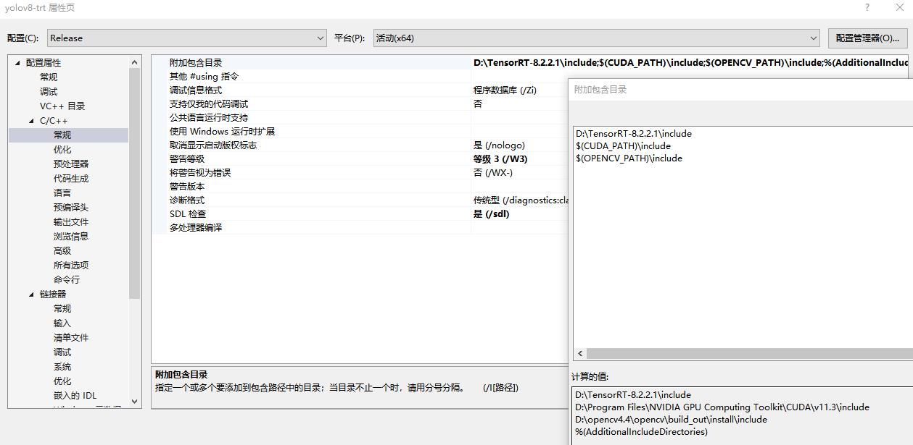
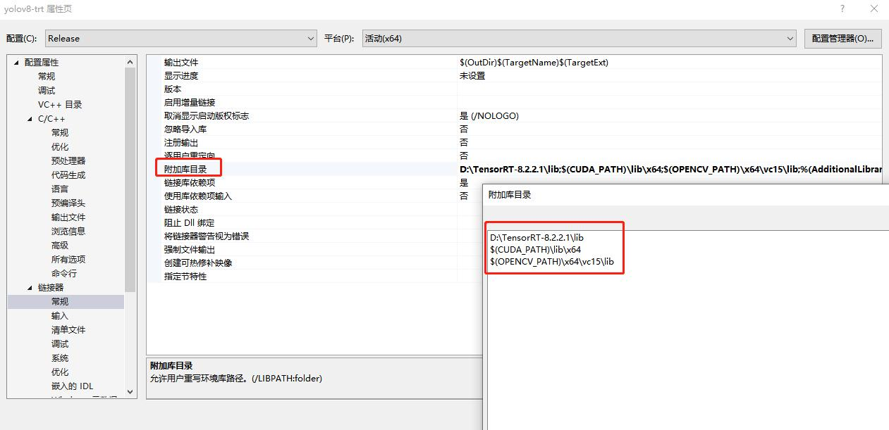
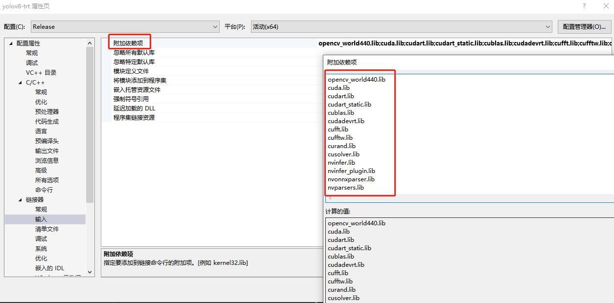

English | [简体中文](README_CH.md)
# YOLOv8-TensorRT-Windows

This is a simplified project that deploys the Yolov8 model for object detection on the Windows platform using TensorRT. </br>
Multi-batch inference Supported ! </br>

---


[](https://developer.nvidia.com/tensorrt)


---


# Prepare the environment

1. Install `CUDA` follow [`CUDA official website`](https://docs.nvidia.com/cuda/cuda-installation-guide-linux/index.html#download-the-nvidia-cuda-toolkit).

   🚀 RECOMMENDED `CUDA` >= 11.3

2. Install `TensorRT` follow [`TensorRT official website`](https://developer.nvidia.com/nvidia-tensorrt-8x-download).

   🚀 RECOMMENDED `TensorRT` >= 8.2

2. Install python requirement.

   ``` shell
   pip install -r requirement.txt
   ```

3. Install [`ultralytics`](https://github.com/ultralytics/ultralytics) package for ONNX export or TensorRT API building.

   ``` shell
   pip install ultralytics
   ```

5. Prepare your own PyTorch weight such as `yolov8n.pt`.


# Usage

## 1. Prepare trained model `*.pt` or pull from [`ultralytics`](https://github.com/ultralytics/ultralytics) directly.

## 2. Export End2End ONNX with NMS

You can export your onnx model by `ultralytics` API and add postprocess such as bbox decoder and `NMS` into ONNX model at the same time.

``` shell
python3 export-det.py \
--weights yolov8n.pt \
--iou-thres 0.65 \
--conf-thres 0.25 \
--topk 100 \
--opset 11 \
--sim \
--input-shape 4 3 640 640 \
--device cuda:0
```

#### Description of all arguments

- `--weights` : The PyTorch model you trained.
- `--iou-thres` : IOU threshold for NMS plugin.
- `--conf-thres` : Confidence threshold for NMS plugin.
- `--topk` : Max number of detection bboxes.
- `--opset` : ONNX opset version, default is 11.
- `--sim` : Whether to simplify your onnx model.
- `--input-shape` : Input shape for you model, should be 4 dimensions.
- `--device` : The CUDA deivce you export engine .


## 3. Build TRT Engine 
``` shell
trtexec --onnx=yolov8n.onnx --saveEngine=yolov8n.bin --workspace=3000 --verbose --fp16
```

## Inference

### 1. Infer with python script

You can infer images with the engine by [`infer-det.py`](infer-det.py) .

Usage:

Unzip the `inference\yolov8-trt\yolov8-trt\models\yolov8n_b4.zip` file to the current directory to obtain the compiled TRT engine yolov8n_b4.bin.

Note:

Different GPU devices require recompilation.

``` shell
python3 infer-det.py \
--engine yolov8n.bin \
--imgs data \
--show \
--out-dir outputs \
--device cuda:0
```

#### Description of all arguments

- `--engine` : The Engine you export.
- `--imgs` : The images path you want to detect.
- `--show` : Whether to show detection results.
- `--out-dir` : Where to save detection results images. It will not work when use `--show` flag.
- `--device` : The CUDA deivce you use.
- `--profile` : Profile the TensorRT engine.

### 2. Infer with C++

You can infer with c++ in [`inference/yolov8-trt`](inference/yolov8-trt) .

### Environment configuration:
#### 1. Set Additional Include Directory


#### 2. Set Additional Library Directory


#### 3. Add Additional Dependencies

``` shell
opencv_world440.lib
cuda.lib
cudart.lib
cudart_static.lib
cublas.lib
cudadevrt.lib
cufft.lib
cufftw.lib
curand.lib
cusolver.lib
nvinfer.lib
nvinfer_plugin.lib
nvonnxparser.lib
nvparsers.lib
```


Usage:

Modify this part:
``` c++
cudaSetDevice(0);  // GPU ID
int img_h = 640;
int img_w = 640;
int batch_size = 4;
const std::string engine_file_path = "models\\yolov8n_b4.bin";
std::string out_path = "results\\";  // path to save results
std::vector<std::string> img_path_list;
img_path_list.push_back("images\\1.jpg");  // image path
img_path_list.push_back("images\\2.jpg");
img_path_list.push_back("images\\3.jpg");
img_path_list.push_back("images\\4.jpg");
```

Compile and run `main.cpp`.

# Inference Speed
| model name | input size | batch size | precision | language | GPU   | ms/img |  
| -------- | -------- | -------- | ------- | -------- | -------- | -------- |  
| yolov8n   | 640x640x3 | 1     | FP32   | C++    | GTX 1060 | 5.3    |  
| yolov8n   | 640x640x3 | 4     | FP32   | C++    | GTX 1060 | 4.35   |  
| yolov8l   | 640x640x3 | 1     | FP32   | C++    | GTX 1060 | 41    |  
| yolov8l   | 640x640x3 | 4     |FP32   | C++    | GTX 1060 | 38.25 |  

***NOTICE:*** </br>
Limited by its GPU model, the GTX 1060 has poor performance in terms of inference speed, and it does not support FP16 precision. Using 30-series GPUs can significantly improve performance.  


# Acknowledgments
- https://github.com/ultralytics/ultralytics
- https://github.com/triple-Mu/YOLOv8-TensorRT
