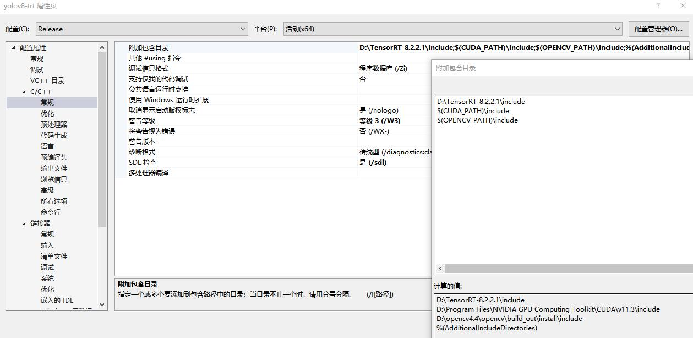
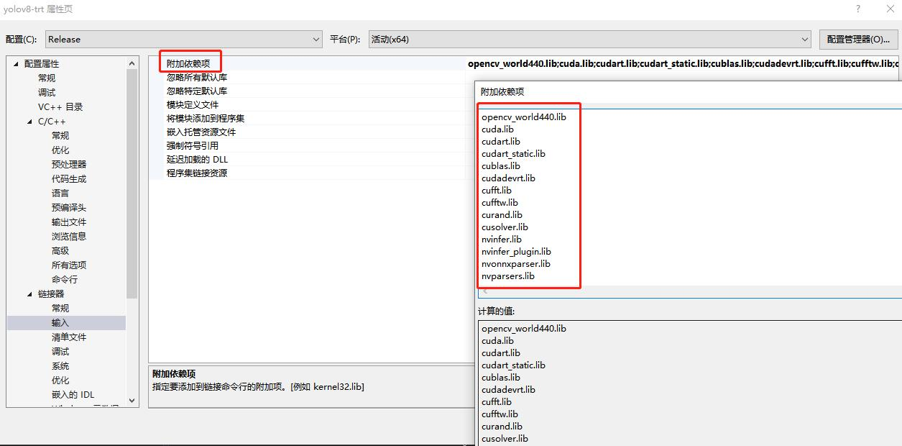

[English](README.md) | 简体中文

# YOLOv8-TensorRT-Windows

这是在Windows平台上使用TensorRT部署Yolo V8进行目标检测的精简工程. </br>
支持多batch推理 ! </br>

---


[](https://developer.nvidia.com/tensorrt)


---


# 环境配置

1. 参照这个网址安装 `CUDA` [`CUDA official website`](https://docs.nvidia.com/cuda/cuda-installation-guide-linux/index.html#download-the-nvidia-cuda-toolkit).

   🚀 推荐 `CUDA` >= 11.3

2. 参照这个网址安装 `TensorRT` [`TensorRT official website`](https://developer.nvidia.com/nvidia-tensorrt-8x-download).

   🚀 推荐 `TensorRT` >= 8.2

2. 安装Python依赖包.

   ``` shell
   pip install -r requirement.txt
   ```

3. 安装 [`ultralytics`](https://github.com/ultralytics/ultralytics) 库，用于导出ONNX模型或者通过TensorRT API构建模型.

   ``` shell
   pip install ultralytics
   ```

5. 准备自己训练好的Pytorch模型，例如 `yolov8n.pt`.


# Usage

## 1. 准备已经训练好的 `*.pt`模型 or 直接从 [`ultralytics`](https://github.com/ultralytics/ultralytics) 工程获取.

## 2. 导出带有`NMS`操作的端到端ONNX模型

通过下面的指令可以导出包含`后处理`和`NMS`操作的ONNX模型。

``` shell
python3 export-det.py \
--weights yolov8n.pt \
--iou-thres 0.65 \
--conf-thres 0.25 \
--topk 100 \
--opset 11 \
--sim \
--input-shape 4 3 640 640 \
--device cuda:0
```

#### 参数详解

- `--weights` : 训练好的模型权重
- `--iou-thres` : NMS 操作的IOU阈值.
- `--conf-thres` : NMS操作额置信度阈值.
- `--topk` : 一张图片最多检测的目标数量.
- `--opset` : ONNX 算子版本, 默认是 11.
- `--sim` : 是否需要简化ONNX模型.
- `--input-shape` : 模型输入尺寸, 应该是4维的.
- `--device` : GPU ID.


## 3. 编译 TRT Engine 
``` shell
trtexec --onnx=yolov8n.onnx --saveEngine=yolov8n.bin --workspace=3000 --verbose --fp16
```

## 推理

### 1. Python脚本推理

你可以使用这个Python脚本推理图片 [`infer-det.py`](infer-det.py) .

Usage:

``` shell
python3 infer-det.py \
--engine yolov8n.bin \
--imgs data \
--show \
--out-dir outputs \
--device cuda:0
```

#### 参数详解

- `--engine` : TRT模型路径.
- `--imgs` : 图片路径.
- `--show` : 是否显示推理结果.
- `--out-dir` : 图片保存路径. 当启用 `--show` 标志符时，当前项不生效.
- `--device` : GPU ID.
- `--profile` : 是否要分析TRT模型.

### 2. Infer with C++

你可以使用这个C++工程推理图片 [`inference/yolov8-trt`](inference/yolov8-trt) .

### C++工程环境配置:
🚀 推荐Visual Studio版本 >= 2017
#### 1. 设置附加包含目录


#### 2. 设置附加库目录


#### 3. 设置附加依赖项

``` shell
opencv_world440.lib
cuda.lib
cudart.lib
cudart_static.lib
cublas.lib
cudadevrt.lib
cufft.lib
cufftw.lib
curand.lib
cusolver.lib
nvinfer.lib
nvinfer_plugin.lib
nvonnxparser.lib
nvparsers.lib
```


使用:

修改这个部分:
``` c++
cudaSetDevice(0);  // GPU ID
int img_h = 640;
int img_w = 640;
int batch_size = 4;
const std::string engine_file_path = "models\\yolov8n_b4.bin";
std::string out_path = "results\\";  // 保存推理结果的路径
std::vector<std::string> img_path_list;
img_path_list.push_back("images\\1.jpg");  // 图片路径
img_path_list.push_back("images\\2.jpg");
img_path_list.push_back("images\\3.jpg");
img_path_list.push_back("images\\4.jpg");
```

编译并运行 `main.cpp`.

# 推理速度
| model name | input size | batch size | precision | language | GPU   | ms/img |  
| -------- | -------- | -------- | ------- | -------- | -------- | -------- |  
| yolov8n   | 640x640x3 | 1     | FP32   | C++    | GTX 1060 | 5.3    |  
| yolov8n   | 640x640x3 | 4     | FP32   | C++    | GTX 1060 | 4.35   |  
| yolov8l   | 640x640x3 | 1     | FP32   | C++    | GTX 1060 | 41    |  
| yolov8l   | 640x640x3 | 4     |FP32   | C++    | GTX 1060 | 38.25 |  
  
***提示:*** </br>
受显卡型号限制，GTX 1060性能较差，推理速度并不快，并且不支持FP16精度，如果采用30系列显卡速度可以加快几倍。

# 答谢
- https://github.com/ultralytics/ultralytics
- https://github.com/triple-Mu/YOLOv8-TensorRT